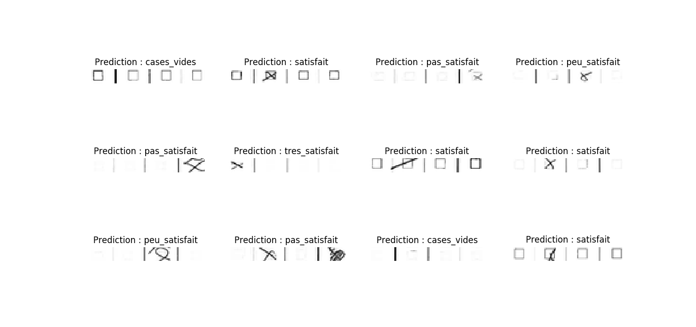

**README**

The purpose of this project is to automatically find out which answer
is given in a MCQ.

**data.tar.gz**

This archive should be uncompressed and extracted.
In order to do this, please use:

`tar zxvf data.tar.gz`

**best_satisfaction_classifier.h5**

This file was generated by *train_satisfaction_classifier.py*, it
contains the weights, the optimizer and the architecture of the trained
model. It is loaded by *prediction_with_best_model.py*.

When you train the CNN using *train_satisfaction_classifier.py*, if your results are
good you can replace *best_satisfaction_classifier.h5* by your freshly
generated *satisfaction_classifier.h5*.

For now the accuracy is about 95% on the test set.

This is an example of the results with a predictable mistake

